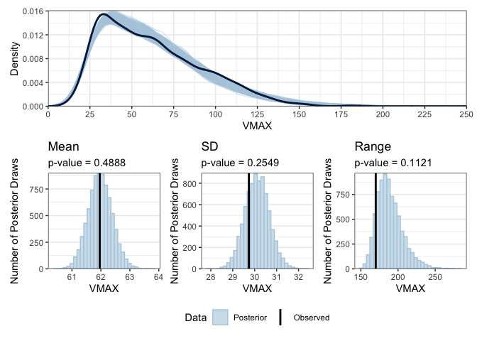

Tyler Pollard
2024-08-25

- [Introduction](#introduction)
- [Data Exploration (Shiny App)](#data-exploration-shiny-app)
- [Model Description](#model-description)
  - [Log-normal](#log-normal)
  - [Gamma](#gamma)
- [Model Comparisons](#model-comparisons)
  - [Model Refinement](#model-refinement)
  - [Final Model](#final-model)
- [Goodness of Fit](#goodness-of-fit)
- [Variable Importance](#variable-importance)
- [Prediction](#prediction)
  - [Cross-Validation](#cross-validation)
  - [Out-of-Sample](#out-of-sample)
    - [Prediction Plots](#prediction-plots)
    - [Key Takeaways](#key-takeaways)
- [Discussion](#discussion)
  - [Limitations](#limitations)
  - [Future Work](#future-work)

# Introduction

The data for this analysis are from [A Feed Forward Neural Network Based
on Model Output Statistics for Short-Term Hurricane Intensity
Prediction](https://journals.ametsoc.org/view/journals/wefo/34/4/waf-d-18-0173_1.xml),
with detailed variable descriptions available
[here](https://github.com/TylerPollard410/Hurricane-Analysis/blob/main/docs/data_description.pdf).
This paper uses deep learning to improve 24-hour ahead forecasts of
hurricane intensity (maximum wind velocity, VMAX).

The primary prediction model,
[HWRF](https://www.aoml.noaa.gov/hurricane-weather-research-forecast-model/),
which is a mathematical weather prediction model based on differential
equations. In addition to the forecast, HWRF has many other state
variables such as **sea surface temperature, longitude, time of year,
etc**, that are usually discarded.

This analysis aims to assess whether incorporating these **HWRF state
variables** can enhance the accuracy of hurricane intensity predictions

# Data Exploration (Shiny App)

To facilitate exploratory analysis, I developed an interactive
<a href="https://tylerpollard410.shinyapps.io/Hurricane_EDA/" target="_blank"><b>
Hurricane Analysis app</b></a>. This tool enables the visualization of
key variables and their relationships with VMAX:

- The Histogram plot reveals that **VMAX exhibits positive right-skewed
  distribution**.
- The Map feature illustrates the geographic influence of spatial
  variables like basin, land presence, latitude, and longitude.
- Scatter plots of VMAX against potential predictors highlight the
  importance of **feature transformations** for model fitting.

# Model Description

The response variable $Y_i$ is the observed VMAX for each hurricane
observation. The dataset consists of $i = 1, ..., n = 1705$ total
observations from 87 unique storms, where each storm is identified by a
StormID ($S_i$). Every observation is associated with $p = 20$
covariates ($X_{ij}$, where $j = 1, ..., p$) that capture key **spatial
characteristics**, **environmental conditions**, and **forecast-based
features** relevant to hurricane intensity.

Observations are recorded at **6-hour intervals**, representing
StormElapsedTime. However, some storms have missing increments, making
the time sequence irregular. StormElapsedTime was not included as a
predictor in the model because the HWRF model already accounts for time
evolution through its differential equation framework.

To ensure comparability across variables, all covariates underwent the
following preprocessing steps:

1.  **Arcsinh transformation** was applied to handle skewed
    distributions.
2.  **Centering** and **scaling** were performed to standardize the
    variables.

Given the positive right-skewed distribution of VMAX, two likelihood
functions were considered:

## Log-normal

$$
\begin{aligned}
Y_{i} &\sim \text{LogNormal}(\mu_i, \sigma^2) \\
\mu_i &= \beta_{0} + \sum_{j=1}^{p}X_{ij}\beta_{j} + \theta_{S_i} \\
\theta_{S_i} &\sim \text{Normal}(0, \tau^2)
\end{aligned}
$$

## Gamma

$$
\begin{aligned}
Y_{i} &\sim \text{Gamma}(\alpha, \alpha/\mu_i) \\
log(\mu_i) &= \beta_{0} + \sum_{j=1}^{p}X_{ij}\beta_{j} + \theta_{S_i} \\
\theta_{S_i} &\sim \text{Normal}(0, \tau^2)
\end{aligned}
$$

where $\beta_{j}$ is the effect of covariate $j$ with weakly informative
priors $\beta_j \sim \text{Normal}(0,5)$. We set a weakly prior on
$\alpha \sim \text{InvGamma}(0.1, 0.1)$. In the random effects models,
we set weakly priors $\tau \sim \text{InvGamma}(0.1, 0.1)$, otherwise
$\theta_{S_i} = 0$.

# Model Comparisons

All four models were fit to the data and assessed for convergence to
ensure reliable parameter estimates. After confirming convergence, model
selection was performed using the **Widely Applicable Information
Criterion (WAIC)** and **Expected Log Predictive Density (ELPD)**, both
of which estimates out-of-sample predictive accuracy. Table 1 presents
the WAIC values along with associated parameters for each model:

  &#10;  <table class="gt_table" data-quarto-disable-processing="false" data-quarto-bootstrap="false" style="-webkit-font-smoothing: antialiased; -moz-osx-font-smoothing: grayscale; font-family: system-ui, 'Segoe UI', Roboto, Helvetica, Arial, sans-serif, 'Apple Color Emoji', 'Segoe UI Emoji', 'Segoe UI Symbol', 'Noto Color Emoji'; display: table; border-collapse: collapse; line-height: normal; margin-left: auto; margin-right: auto; color: #333333; font-size: 16px; font-weight: normal; font-style: normal; background-color: #F2F2F2; width: auto; border-top-style: solid; border-top-width: 2px; border-top-color: #A8A8A8; border-right-style: none; border-right-width: 2px; border-right-color: #D3D3D3; border-bottom-style: solid; border-bottom-width: 2px; border-bottom-color: #A8A8A8; border-left-style: none; border-left-width: 2px; border-left-color: #D3D3D3;" bgcolor="#F2F2F2">
  <caption>Table 1: Model Selection Criteria Using WAIC and ELPD</caption>
  <thead style="border-style: none;">
    <tr class="gt_col_headings" style="border-style: none; border-top-style: solid; border-top-width: 2px; border-top-color: #D3D3D3; border-bottom-style: solid; border-bottom-width: 2px; border-bottom-color: #D3D3D3; border-left-style: none; border-left-width: 1px; border-left-color: #D3D3D3; border-right-style: none; border-right-width: 1px; border-right-color: #D3D3D3;">
      <th class="gt_col_heading gt_columns_bottom_border gt_left" rowspan="1" colspan="1" style="border-style: none; font-size: 100%; font-weight: normal; text-transform: inherit; border-left-style: none; border-left-width: 1px; border-left-color: #D3D3D3; vertical-align: bottom; padding-top: 10px; padding-bottom: 11px; padding-left: 5px; padding-right: 5px; overflow-x: hidden; text-align: left; border-right-width: 1px; border-right-style: solid; border-right-color: #000000; background-color: #373737; color: #FFFFFF;" scope="col" id="Model" bgcolor="#373737" valign="bottom" align="left">Model</th>
      <th class="gt_col_heading gt_columns_bottom_border gt_center" rowspan="1" colspan="1" style="border-style: none; font-size: 100%; font-weight: normal; text-transform: inherit; border-left-style: none; border-left-width: 1px; border-left-color: #D3D3D3; border-right-style: none; border-right-width: 1px; border-right-color: #D3D3D3; vertical-align: bottom; padding-top: 10px; padding-bottom: 11px; padding-left: 5px; padding-right: 5px; overflow-x: hidden; text-align: center; background-color: #373737; color: #FFFFFF;" scope="col" id="waic" bgcolor="#373737" valign="bottom" align="center">waic1</th>
      <th class="gt_col_heading gt_columns_bottom_border gt_center" rowspan="1" colspan="1" style="border-style: none; font-size: 100%; font-weight: normal; text-transform: inherit; border-left-style: none; border-left-width: 1px; border-left-color: #D3D3D3; border-right-style: none; border-right-width: 1px; border-right-color: #D3D3D3; vertical-align: bottom; padding-top: 10px; padding-bottom: 11px; padding-left: 5px; padding-right: 5px; overflow-x: hidden; text-align: center; background-color: #373737; color: #FFFFFF;" scope="col" id="p_waic" bgcolor="#373737" valign="bottom" align="center">p_waic2</th>
      <th class="gt_col_heading gt_columns_bottom_border gt_center" rowspan="1" colspan="1" style="border-style: none; font-size: 100%; font-weight: normal; text-transform: inherit; border-left-style: none; border-left-width: 1px; border-left-color: #D3D3D3; border-right-style: none; border-right-width: 1px; border-right-color: #D3D3D3; vertical-align: bottom; padding-top: 10px; padding-bottom: 11px; padding-left: 5px; padding-right: 5px; overflow-x: hidden; text-align: center; background-color: #373737; color: #FFFFFF;" scope="col" id="elpd_waic" bgcolor="#373737" valign="bottom" align="center">elpd_waic3</th>
      <th class="gt_col_heading gt_columns_bottom_border gt_center" rowspan="1" colspan="1" style="border-style: none; font-size: 100%; font-weight: normal; text-transform: inherit; border-left-style: none; border-left-width: 1px; border-left-color: #D3D3D3; border-right-style: none; border-right-width: 1px; border-right-color: #D3D3D3; vertical-align: bottom; padding-top: 10px; padding-bottom: 11px; padding-left: 5px; padding-right: 5px; overflow-x: hidden; text-align: center; background-color: #373737; color: #FFFFFF;" scope="col" id="elpd_diff" bgcolor="#373737" valign="bottom" align="center">elpd_diff4</th>
      <th class="gt_col_heading gt_columns_bottom_border gt_center" rowspan="1" colspan="1" style="border-style: none; font-size: 100%; font-weight: normal; text-transform: inherit; border-left-style: none; border-left-width: 1px; border-left-color: #D3D3D3; border-right-style: none; border-right-width: 1px; border-right-color: #D3D3D3; vertical-align: bottom; padding-top: 10px; padding-bottom: 11px; padding-left: 5px; padding-right: 5px; overflow-x: hidden; text-align: center; background-color: #373737; color: #FFFFFF;" scope="col" id="se_diff" bgcolor="#373737" valign="bottom" align="center">se_diff5</th>
    </tr>
  </thead>
  <tbody class="gt_table_body" style="border-style: none; border-top-style: solid; border-top-width: 2px; border-top-color: #D3D3D3; border-bottom-style: solid; border-bottom-width: 2px; border-bottom-color: #D3D3D3;">
    <tr style="border-style: none;"><td headers="Model" class="gt_row gt_left" style="border-style: none; padding-top: 8px; padding-bottom: 8px; padding-left: 5px; padding-right: 5px; margin: 10px; border-top-style: solid; border-top-width: 1px; border-top-color: #D3D3D3; border-left-style: none; border-left-width: 1px; border-left-color: #D3D3D3; vertical-align: middle; overflow-x: hidden; text-align: left; border-right-width: 1px; border-right-style: solid; border-right-color: #000000;" valign="middle" align="left">Log-normal (Random Effects)</td>
<td headers="waic" class="gt_row gt_center" style="border-style: none; padding-top: 8px; padding-bottom: 8px; padding-left: 5px; padding-right: 5px; margin: 10px; border-top-style: solid; border-top-width: 1px; border-top-color: #D3D3D3; border-left-style: none; border-left-width: 1px; border-left-color: #D3D3D3; border-right-style: none; border-right-width: 1px; border-right-color: #D3D3D3; vertical-align: middle; overflow-x: hidden; text-align: center;" valign="middle" align="center">12697.84</td>
<td headers="p_waic" class="gt_row gt_center" style="border-style: none; padding-top: 8px; padding-bottom: 8px; padding-left: 5px; padding-right: 5px; margin: 10px; border-top-style: solid; border-top-width: 1px; border-top-color: #D3D3D3; border-left-style: none; border-left-width: 1px; border-left-color: #D3D3D3; border-right-style: none; border-right-width: 1px; border-right-color: #D3D3D3; vertical-align: middle; overflow-x: hidden; text-align: center;" valign="middle" align="center">91.02</td>
<td headers="elpd_waic" class="gt_row gt_center" style="border-style: none; padding-top: 8px; padding-bottom: 8px; padding-left: 5px; padding-right: 5px; margin: 10px; border-top-style: solid; border-top-width: 1px; border-top-color: #D3D3D3; border-left-style: none; border-left-width: 1px; border-left-color: #D3D3D3; border-right-style: none; border-right-width: 1px; border-right-color: #D3D3D3; vertical-align: middle; overflow-x: hidden; text-align: center;" valign="middle" align="center">−6348.92</td>
<td headers="elpd_diff" class="gt_row gt_center" style="border-style: none; padding-top: 8px; padding-bottom: 8px; padding-left: 5px; padding-right: 5px; margin: 10px; border-top-style: solid; border-top-width: 1px; border-top-color: #D3D3D3; border-left-style: none; border-left-width: 1px; border-left-color: #D3D3D3; border-right-style: none; border-right-width: 1px; border-right-color: #D3D3D3; vertical-align: middle; overflow-x: hidden; text-align: center;" valign="middle" align="center">0.00</td>
<td headers="se_diff" class="gt_row gt_center" style="border-style: none; padding-top: 8px; padding-bottom: 8px; padding-left: 5px; padding-right: 5px; margin: 10px; border-top-style: solid; border-top-width: 1px; border-top-color: #D3D3D3; border-left-style: none; border-left-width: 1px; border-left-color: #D3D3D3; border-right-style: none; border-right-width: 1px; border-right-color: #D3D3D3; vertical-align: middle; overflow-x: hidden; text-align: center;" valign="middle" align="center">0.00</td></tr>
    <tr style="border-style: none;"><td headers="Model" class="gt_row gt_left" style="border-style: none; padding-top: 8px; padding-bottom: 8px; padding-left: 5px; padding-right: 5px; margin: 10px; border-top-style: solid; border-top-width: 1px; border-top-color: #D3D3D3; border-left-style: none; border-left-width: 1px; border-left-color: #D3D3D3; vertical-align: middle; overflow-x: hidden; text-align: left; border-right-width: 1px; border-right-style: solid; border-right-color: #000000;" valign="middle" align="left">Gamma (Random Effects)</td>
<td headers="waic" class="gt_row gt_center" style="border-style: none; padding-top: 8px; padding-bottom: 8px; padding-left: 5px; padding-right: 5px; margin: 10px; border-top-style: solid; border-top-width: 1px; border-top-color: #D3D3D3; border-left-style: none; border-left-width: 1px; border-left-color: #D3D3D3; border-right-style: none; border-right-width: 1px; border-right-color: #D3D3D3; vertical-align: middle; overflow-x: hidden; text-align: center;" valign="middle" align="center">12712.67</td>
<td headers="p_waic" class="gt_row gt_center" style="border-style: none; padding-top: 8px; padding-bottom: 8px; padding-left: 5px; padding-right: 5px; margin: 10px; border-top-style: solid; border-top-width: 1px; border-top-color: #D3D3D3; border-left-style: none; border-left-width: 1px; border-left-color: #D3D3D3; border-right-style: none; border-right-width: 1px; border-right-color: #D3D3D3; vertical-align: middle; overflow-x: hidden; text-align: center;" valign="middle" align="center">92.91</td>
<td headers="elpd_waic" class="gt_row gt_center" style="border-style: none; padding-top: 8px; padding-bottom: 8px; padding-left: 5px; padding-right: 5px; margin: 10px; border-top-style: solid; border-top-width: 1px; border-top-color: #D3D3D3; border-left-style: none; border-left-width: 1px; border-left-color: #D3D3D3; border-right-style: none; border-right-width: 1px; border-right-color: #D3D3D3; vertical-align: middle; overflow-x: hidden; text-align: center;" valign="middle" align="center">−6356.33</td>
<td headers="elpd_diff" class="gt_row gt_center" style="border-style: none; padding-top: 8px; padding-bottom: 8px; padding-left: 5px; padding-right: 5px; margin: 10px; border-top-style: solid; border-top-width: 1px; border-top-color: #D3D3D3; border-left-style: none; border-left-width: 1px; border-left-color: #D3D3D3; border-right-style: none; border-right-width: 1px; border-right-color: #D3D3D3; vertical-align: middle; overflow-x: hidden; text-align: center;" valign="middle" align="center">−7.41</td>
<td headers="se_diff" class="gt_row gt_center" style="border-style: none; padding-top: 8px; padding-bottom: 8px; padding-left: 5px; padding-right: 5px; margin: 10px; border-top-style: solid; border-top-width: 1px; border-top-color: #D3D3D3; border-left-style: none; border-left-width: 1px; border-left-color: #D3D3D3; border-right-style: none; border-right-width: 1px; border-right-color: #D3D3D3; vertical-align: middle; overflow-x: hidden; text-align: center;" valign="middle" align="center">4.18</td></tr>
    <tr style="border-style: none;"><td headers="Model" class="gt_row gt_left" style="border-style: none; padding-top: 8px; padding-bottom: 8px; padding-left: 5px; padding-right: 5px; margin: 10px; border-top-style: solid; border-top-width: 1px; border-top-color: #D3D3D3; border-left-style: none; border-left-width: 1px; border-left-color: #D3D3D3; vertical-align: middle; overflow-x: hidden; text-align: left; border-right-width: 1px; border-right-style: solid; border-right-color: #000000;" valign="middle" align="left">Log-normal (Fixed Effects)</td>
<td headers="waic" class="gt_row gt_center" style="border-style: none; padding-top: 8px; padding-bottom: 8px; padding-left: 5px; padding-right: 5px; margin: 10px; border-top-style: solid; border-top-width: 1px; border-top-color: #D3D3D3; border-left-style: none; border-left-width: 1px; border-left-color: #D3D3D3; border-right-style: none; border-right-width: 1px; border-right-color: #D3D3D3; vertical-align: middle; overflow-x: hidden; text-align: center;" valign="middle" align="center">12835.91</td>
<td headers="p_waic" class="gt_row gt_center" style="border-style: none; padding-top: 8px; padding-bottom: 8px; padding-left: 5px; padding-right: 5px; margin: 10px; border-top-style: solid; border-top-width: 1px; border-top-color: #D3D3D3; border-left-style: none; border-left-width: 1px; border-left-color: #D3D3D3; border-right-style: none; border-right-width: 1px; border-right-color: #D3D3D3; vertical-align: middle; overflow-x: hidden; text-align: center;" valign="middle" align="center">22.22</td>
<td headers="elpd_waic" class="gt_row gt_center" style="border-style: none; padding-top: 8px; padding-bottom: 8px; padding-left: 5px; padding-right: 5px; margin: 10px; border-top-style: solid; border-top-width: 1px; border-top-color: #D3D3D3; border-left-style: none; border-left-width: 1px; border-left-color: #D3D3D3; border-right-style: none; border-right-width: 1px; border-right-color: #D3D3D3; vertical-align: middle; overflow-x: hidden; text-align: center;" valign="middle" align="center">−6417.95</td>
<td headers="elpd_diff" class="gt_row gt_center" style="border-style: none; padding-top: 8px; padding-bottom: 8px; padding-left: 5px; padding-right: 5px; margin: 10px; border-top-style: solid; border-top-width: 1px; border-top-color: #D3D3D3; border-left-style: none; border-left-width: 1px; border-left-color: #D3D3D3; border-right-style: none; border-right-width: 1px; border-right-color: #D3D3D3; vertical-align: middle; overflow-x: hidden; text-align: center;" valign="middle" align="center">−69.03</td>
<td headers="se_diff" class="gt_row gt_center" style="border-style: none; padding-top: 8px; padding-bottom: 8px; padding-left: 5px; padding-right: 5px; margin: 10px; border-top-style: solid; border-top-width: 1px; border-top-color: #D3D3D3; border-left-style: none; border-left-width: 1px; border-left-color: #D3D3D3; border-right-style: none; border-right-width: 1px; border-right-color: #D3D3D3; vertical-align: middle; overflow-x: hidden; text-align: center;" valign="middle" align="center">12.87</td></tr>
    <tr style="border-style: none;"><td headers="Model" class="gt_row gt_left" style="border-style: none; padding-top: 8px; padding-bottom: 8px; padding-left: 5px; padding-right: 5px; margin: 10px; border-top-style: solid; border-top-width: 1px; border-top-color: #D3D3D3; border-left-style: none; border-left-width: 1px; border-left-color: #D3D3D3; vertical-align: middle; overflow-x: hidden; text-align: left; border-right-width: 1px; border-right-style: solid; border-right-color: #000000;" valign="middle" align="left">Gamma (Fixed Effects)</td>
<td headers="waic" class="gt_row gt_center" style="border-style: none; padding-top: 8px; padding-bottom: 8px; padding-left: 5px; padding-right: 5px; margin: 10px; border-top-style: solid; border-top-width: 1px; border-top-color: #D3D3D3; border-left-style: none; border-left-width: 1px; border-left-color: #D3D3D3; border-right-style: none; border-right-width: 1px; border-right-color: #D3D3D3; vertical-align: middle; overflow-x: hidden; text-align: center;" valign="middle" align="center">12863.94</td>
<td headers="p_waic" class="gt_row gt_center" style="border-style: none; padding-top: 8px; padding-bottom: 8px; padding-left: 5px; padding-right: 5px; margin: 10px; border-top-style: solid; border-top-width: 1px; border-top-color: #D3D3D3; border-left-style: none; border-left-width: 1px; border-left-color: #D3D3D3; border-right-style: none; border-right-width: 1px; border-right-color: #D3D3D3; vertical-align: middle; overflow-x: hidden; text-align: center;" valign="middle" align="center">22.85</td>
<td headers="elpd_waic" class="gt_row gt_center" style="border-style: none; padding-top: 8px; padding-bottom: 8px; padding-left: 5px; padding-right: 5px; margin: 10px; border-top-style: solid; border-top-width: 1px; border-top-color: #D3D3D3; border-left-style: none; border-left-width: 1px; border-left-color: #D3D3D3; border-right-style: none; border-right-width: 1px; border-right-color: #D3D3D3; vertical-align: middle; overflow-x: hidden; text-align: center;" valign="middle" align="center">−6431.97</td>
<td headers="elpd_diff" class="gt_row gt_center" style="border-style: none; padding-top: 8px; padding-bottom: 8px; padding-left: 5px; padding-right: 5px; margin: 10px; border-top-style: solid; border-top-width: 1px; border-top-color: #D3D3D3; border-left-style: none; border-left-width: 1px; border-left-color: #D3D3D3; border-right-style: none; border-right-width: 1px; border-right-color: #D3D3D3; vertical-align: middle; overflow-x: hidden; text-align: center;" valign="middle" align="center">−83.05</td>
<td headers="se_diff" class="gt_row gt_center" style="border-style: none; padding-top: 8px; padding-bottom: 8px; padding-left: 5px; padding-right: 5px; margin: 10px; border-top-style: solid; border-top-width: 1px; border-top-color: #D3D3D3; border-left-style: none; border-left-width: 1px; border-left-color: #D3D3D3; border-right-style: none; border-right-width: 1px; border-right-color: #D3D3D3; vertical-align: middle; overflow-x: hidden; text-align: center;" valign="middle" align="center">13.85</td></tr>
  </tbody>
  &#10;  <tfoot class="gt_footnotes" style="border-style: none; color: #333333; background-color: #F2F2F2; border-bottom-style: none; border-bottom-width: 2px; border-bottom-color: #D3D3D3; border-left-style: none; border-left-width: 2px; border-left-color: #D3D3D3; border-right-style: none; border-right-width: 2px; border-right-color: #D3D3D3;" bgcolor="#F2F2F2">
    <tr style="border-style: none;">
      <td class="gt_footnote" colspan="6" style="border-style: none; margin: 0px; font-size: 90%; padding-top: 4px; padding-bottom: 4px; padding-left: 5px; padding-right: 5px;">1 WAIC (waic): Widely Applicable Information Criterion, a model selection metric balancing fit and complexity. Lower values indicate better expected predictive accuracy.</td>
    </tr>
    <tr style="border-style: none;">
      <td class="gt_footnote" colspan="6" style="border-style: none; margin: 0px; font-size: 90%; padding-top: 4px; padding-bottom: 4px; padding-left: 5px; padding-right: 5px;">2 Effective Parameters (p_waic): An estimate of the number of effective parameters in the model; higher values indicate more flexibility.</td>
    </tr>
    <tr style="border-style: none;">
      <td class="gt_footnote" colspan="6" style="border-style: none; margin: 0px; font-size: 90%; padding-top: 4px; padding-bottom: 4px; padding-left: 5px; padding-right: 5px;">3 ELPD (elpd_waic): Expected log predictive density, quantifying out-of-sample predictive performance. Higher (less negative) values indicate better predictive accuracy.</td>
    </tr>
    <tr style="border-style: none;">
      <td class="gt_footnote" colspan="6" style="border-style: none; margin: 0px; font-size: 90%; padding-top: 4px; padding-bottom: 4px; padding-left: 5px; padding-right: 5px;">4 ELPD Difference (elpd_diff): The difference in elpd_waic relative to the best model (logNormal_Rand_Fit). The best model always has elpd_diff = 0.</td>
    </tr>
    <tr style="border-style: none;">
      <td class="gt_footnote" colspan="6" style="border-style: none; margin: 0px; font-size: 90%; padding-top: 4px; padding-bottom: 4px; padding-left: 5px; padding-right: 5px;">5 SE of Difference (se_diff): The standard error of elpd_diff, measuring uncertainty in the difference estimates. Large absolute elpd_diff values relative to se_diff indicate meaningful performance differences.</td>
    </tr>
  </tfoot>
</table>

Based on WAIC and elpd_diff, the **Log-normal model with random
effects** demonstrated the best overall predictive performance. This
decision was supported by the following observations:

- **Lowest WAIC & Best Predictive Performance**: The log-normal random
  effects model had the smallest WAIC and elpd_diff = 0, meaning no
  other model demonstrated better expected predictive accuracy.
- **Better Likelihood Choice**: Both Log-normal models outperformed
  their Gamma counterparts, suggesting that a log-normal likelihood is
  better suited for modeling VMAX.
- **Importance of Random Effects**: The random effects models
  consistently had lower elpd_diff values than their fixed-effects
  counterparts, reinforcing the need for a random intercept for StormID.
  For example, the fixed-effects log-normal model had elpd_diff =
  -69.03, showing a substantial decrease in predictive performance
  compared to the selected model.

## Model Refinement

After selecting the **Log-normal model with random effects**, additional
refinements were made to improve model interpretability and predictive
performance. The refinement process followed two key steps:

1.  **Addressing Multicollinearity**

    - Covariates with high variance inflation factors (VIF) were
      identified and removed to reduce multicollinearity, ensuring
      stable parameter estimates.
    - TCOND7002, INST2, and SHTFL2 exhibited high VIF values and were
      removed before refitting the model.

2.  **Iterative Variable Selection**

    - To improve model parsimony, variables were removed one at a time,
      with the model iteratively refit after each removal.
    - This process continued until the 95% credible intervals of all
      remaining covariates no longer contained 0, ensuring that only
      statistically meaningful predictors were retained.

## Final Model

After refinement, the final model retained $p = 9$ covariates:

- Land
- Wind Shear Magnitude (SHR_MAG)
- Relative Humidity (RHLO)
- Convective Available Potential Energy (CAPE3)
- Coupling Parameter 1 (CP1)
- Total Condensate Symmetry Parameter (TCONDSYM2)
- Coupling CP3 Parameter (COUPLSYM3)
- HWFI forecast
- HWRF forecast

This final model strikes a balance between **parsimony and predictive
power**, ensuring that only the most relevant predictors are retained
while minimizing unnecessary complexity. By including variables that
significantly contribute to explaining variations in VMAX, the refined
model improves both **interpretability and generalizability** for
forecasting hurricane intensity.

# Goodness of Fit

To assess the model’s goodness of fit, **posterior predictive checks
(PPCs)** were performed by drawing samples from the **posterior
predictive distribution (PPD)**. These checks compare key summary
statistics of the observed data to those generated from the model,
ensuring that the fitted model can replicate important characteristics
of the data.

The figure below displays the empirical distribution of observed VMAX
alongside the posterior predictive distribution, as well as **Bayesian
p-values** for the **mean**, **standard deviation (SD)**, and **range**:

<strong>Figure 1: Posterior Predictive Checks for Log-normal Random
Effects Model</strong>

These **p-values fall within an acceptable range**, staying sufficiently
away from 0 and 1, indicating that the model does not systematically
overestimate or underestimate variability in the data. Additionally, the
**empirical distribution of observed VMAX aligns well** with the
simulated distributions from the PPD draws, further supporting model
adequacy.

Overall, the **PPCs confirm that the model provides a reasonable fit to
the observed data** and successfully captures key characteristics of
VMAX distribution.

# Variable Importance

After fitting the **final model** with **random intercepts** and
**weakly informative priors**, the importance of each covariate was
examined. Table 2 presents the posterior mean, standard deviation, and
95% credible interval for each parameter after **partially pooling over
StormIDs**.

Since all covariates were centered and scaled, the posterior means allow
for direct comparison of covariate importance, where **larger absolute
values indicate stronger effects on VMAX**.

From Table 2, the most influential covariates in modeling VMAX were
**Land, HWFI, and HWRF**. Given that HWRF is already a widely used
forecast for VMAX, its significance in the model is expected. However,
an interesting result is that **HWFI appears to have a larger effect on
VMAX than HWRF**, suggesting it may contribute more predictive value in
this model.

  &#10;  <table class="gt_table" data-quarto-disable-processing="false" data-quarto-bootstrap="false" style="-webkit-font-smoothing: antialiased; -moz-osx-font-smoothing: grayscale; font-family: system-ui, 'Segoe UI', Roboto, Helvetica, Arial, sans-serif, 'Apple Color Emoji', 'Segoe UI Emoji', 'Segoe UI Symbol', 'Noto Color Emoji'; display: table; border-collapse: collapse; line-height: normal; margin-left: auto; margin-right: auto; color: #333333; font-size: 16px; font-weight: normal; font-style: normal; background-color: #F2F2F2; width: auto; border-top-style: solid; border-top-width: 2px; border-top-color: #A8A8A8; border-right-style: none; border-right-width: 2px; border-right-color: #D3D3D3; border-bottom-style: solid; border-bottom-width: 2px; border-bottom-color: #A8A8A8; border-left-style: none; border-left-width: 2px; border-left-color: #D3D3D3;" bgcolor="#F2F2F2">
  <caption>Table 2: Posterior summary for model parameters</caption>
  <thead style="border-style: none;">
    <tr class="gt_col_headings" style="border-style: none; border-top-style: solid; border-top-width: 2px; border-top-color: #D3D3D3; border-bottom-style: solid; border-bottom-width: 2px; border-bottom-color: #D3D3D3; border-left-style: none; border-left-width: 1px; border-left-color: #D3D3D3; border-right-style: none; border-right-width: 1px; border-right-color: #D3D3D3;">
      <th class="gt_col_heading gt_columns_bottom_border gt_left" rowspan="1" colspan="1" style="border-style: none; font-size: 100%; font-weight: normal; text-transform: inherit; border-left-style: none; border-left-width: 1px; border-left-color: #D3D3D3; vertical-align: bottom; padding-top: 10px; padding-bottom: 11px; padding-left: 5px; padding-right: 5px; overflow-x: hidden; text-align: left; border-right-width: 1px; border-right-style: solid; border-right-color: #000000; background-color: #373737; color: #FFFFFF;" scope="col" id="Parameter" bgcolor="#373737" valign="bottom" align="left">Parameter</th>
      <th class="gt_col_heading gt_columns_bottom_border gt_center" rowspan="1" colspan="1" style="border-style: none; font-size: 100%; font-weight: normal; text-transform: inherit; border-left-style: none; border-left-width: 1px; border-left-color: #D3D3D3; border-right-style: none; border-right-width: 1px; border-right-color: #D3D3D3; vertical-align: bottom; padding-top: 10px; padding-bottom: 11px; padding-left: 5px; padding-right: 5px; overflow-x: hidden; text-align: center; background-color: #373737; color: #FFFFFF;" scope="col" id="Mean" bgcolor="#373737" valign="bottom" align="center">Mean</th>
      <th class="gt_col_heading gt_columns_bottom_border gt_center" rowspan="1" colspan="1" style="border-style: none; font-size: 100%; font-weight: normal; text-transform: inherit; border-left-style: none; border-left-width: 1px; border-left-color: #D3D3D3; border-right-style: none; border-right-width: 1px; border-right-color: #D3D3D3; vertical-align: bottom; padding-top: 10px; padding-bottom: 11px; padding-left: 5px; padding-right: 5px; overflow-x: hidden; text-align: center; background-color: #373737; color: #FFFFFF;" scope="col" id="SD" bgcolor="#373737" valign="bottom" align="center">SD</th>
      <th class="gt_col_heading gt_columns_bottom_border gt_center" rowspan="1" colspan="1" style="border-style: none; font-size: 100%; font-weight: normal; text-transform: inherit; border-left-style: none; border-left-width: 1px; border-left-color: #D3D3D3; border-right-style: none; border-right-width: 1px; border-right-color: #D3D3D3; vertical-align: bottom; padding-top: 10px; padding-bottom: 11px; padding-left: 5px; padding-right: 5px; overflow-x: hidden; text-align: center; background-color: #373737; color: #FFFFFF;" scope="col" id="Q2.5" bgcolor="#373737" valign="bottom" align="center">Q2.5</th>
      <th class="gt_col_heading gt_columns_bottom_border gt_center" rowspan="1" colspan="1" style="border-style: none; font-size: 100%; font-weight: normal; text-transform: inherit; border-left-style: none; border-left-width: 1px; border-left-color: #D3D3D3; border-right-style: none; border-right-width: 1px; border-right-color: #D3D3D3; vertical-align: bottom; padding-top: 10px; padding-bottom: 11px; padding-left: 5px; padding-right: 5px; overflow-x: hidden; text-align: center; background-color: #373737; color: #FFFFFF;" scope="col" id="Q97.5" bgcolor="#373737" valign="bottom" align="center">Q97.5</th>
    </tr>
  </thead>
  <tbody class="gt_table_body" style="border-style: none; border-top-style: solid; border-top-width: 2px; border-top-color: #D3D3D3; border-bottom-style: solid; border-bottom-width: 2px; border-bottom-color: #D3D3D3;">
    <tr style="border-style: none;"><td headers="Parameter" class="gt_row gt_left" style="border-style: none; padding-top: 8px; padding-bottom: 8px; padding-left: 5px; padding-right: 5px; margin: 10px; border-top-style: solid; border-top-width: 1px; border-top-color: #D3D3D3; border-left-style: none; border-left-width: 1px; border-left-color: #D3D3D3; vertical-align: middle; overflow-x: hidden; text-align: left; border-right-width: 1px; border-right-style: solid; border-right-color: #000000;" valign="middle" align="left">Intercept</td>
<td headers="Mean" class="gt_row gt_center" style="border-style: none; padding-top: 8px; padding-bottom: 8px; padding-left: 5px; padding-right: 5px; margin: 10px; border-top-style: solid; border-top-width: 1px; border-top-color: #D3D3D3; border-left-style: none; border-left-width: 1px; border-left-color: #D3D3D3; border-right-style: none; border-right-width: 1px; border-right-color: #D3D3D3; vertical-align: middle; overflow-x: hidden; text-align: center;" valign="middle" align="center">4.0114</td>
<td headers="SD" class="gt_row gt_center" style="border-style: none; padding-top: 8px; padding-bottom: 8px; padding-left: 5px; padding-right: 5px; margin: 10px; border-top-style: solid; border-top-width: 1px; border-top-color: #D3D3D3; border-left-style: none; border-left-width: 1px; border-left-color: #D3D3D3; border-right-style: none; border-right-width: 1px; border-right-color: #D3D3D3; vertical-align: middle; overflow-x: hidden; text-align: center;" valign="middle" align="center">0.0111</td>
<td headers="Q2.5" class="gt_row gt_center" style="border-style: none; padding-top: 8px; padding-bottom: 8px; padding-left: 5px; padding-right: 5px; margin: 10px; border-top-style: solid; border-top-width: 1px; border-top-color: #D3D3D3; border-left-style: none; border-left-width: 1px; border-left-color: #D3D3D3; border-right-style: none; border-right-width: 1px; border-right-color: #D3D3D3; vertical-align: middle; overflow-x: hidden; text-align: center;" valign="middle" align="center">3.9891</td>
<td headers="Q97.5" class="gt_row gt_center" style="border-style: none; padding-top: 8px; padding-bottom: 8px; padding-left: 5px; padding-right: 5px; margin: 10px; border-top-style: solid; border-top-width: 1px; border-top-color: #D3D3D3; border-left-style: none; border-left-width: 1px; border-left-color: #D3D3D3; border-right-style: none; border-right-width: 1px; border-right-color: #D3D3D3; vertical-align: middle; overflow-x: hidden; text-align: center;" valign="middle" align="center">4.0330</td></tr>
    <tr style="border-style: none;"><td headers="Parameter" class="gt_row gt_left" style="border-style: none; padding-top: 8px; padding-bottom: 8px; padding-left: 5px; padding-right: 5px; margin: 10px; border-top-style: solid; border-top-width: 1px; border-top-color: #D3D3D3; border-left-style: none; border-left-width: 1px; border-left-color: #D3D3D3; vertical-align: middle; overflow-x: hidden; text-align: left; border-right-width: 1px; border-right-style: solid; border-right-color: #000000;" valign="middle" align="left">LandLand</td>
<td headers="Mean" class="gt_row gt_center" style="border-style: none; padding-top: 8px; padding-bottom: 8px; padding-left: 5px; padding-right: 5px; margin: 10px; border-top-style: solid; border-top-width: 1px; border-top-color: #D3D3D3; border-left-style: none; border-left-width: 1px; border-left-color: #D3D3D3; border-right-style: none; border-right-width: 1px; border-right-color: #D3D3D3; vertical-align: middle; overflow-x: hidden; text-align: center;" valign="middle" align="center">-0.1175</td>
<td headers="SD" class="gt_row gt_center" style="border-style: none; padding-top: 8px; padding-bottom: 8px; padding-left: 5px; padding-right: 5px; margin: 10px; border-top-style: solid; border-top-width: 1px; border-top-color: #D3D3D3; border-left-style: none; border-left-width: 1px; border-left-color: #D3D3D3; border-right-style: none; border-right-width: 1px; border-right-color: #D3D3D3; vertical-align: middle; overflow-x: hidden; text-align: center;" valign="middle" align="center">0.0243</td>
<td headers="Q2.5" class="gt_row gt_center" style="border-style: none; padding-top: 8px; padding-bottom: 8px; padding-left: 5px; padding-right: 5px; margin: 10px; border-top-style: solid; border-top-width: 1px; border-top-color: #D3D3D3; border-left-style: none; border-left-width: 1px; border-left-color: #D3D3D3; border-right-style: none; border-right-width: 1px; border-right-color: #D3D3D3; vertical-align: middle; overflow-x: hidden; text-align: center;" valign="middle" align="center">-0.1655</td>
<td headers="Q97.5" class="gt_row gt_center" style="border-style: none; padding-top: 8px; padding-bottom: 8px; padding-left: 5px; padding-right: 5px; margin: 10px; border-top-style: solid; border-top-width: 1px; border-top-color: #D3D3D3; border-left-style: none; border-left-width: 1px; border-left-color: #D3D3D3; border-right-style: none; border-right-width: 1px; border-right-color: #D3D3D3; vertical-align: middle; overflow-x: hidden; text-align: center;" valign="middle" align="center">-0.0699</td></tr>
    <tr style="border-style: none;"><td headers="Parameter" class="gt_row gt_left" style="border-style: none; padding-top: 8px; padding-bottom: 8px; padding-left: 5px; padding-right: 5px; margin: 10px; border-top-style: solid; border-top-width: 1px; border-top-color: #D3D3D3; border-left-style: none; border-left-width: 1px; border-left-color: #D3D3D3; vertical-align: middle; overflow-x: hidden; text-align: left; border-right-width: 1px; border-right-style: solid; border-right-color: #000000;" valign="middle" align="left">SHR_MAG</td>
<td headers="Mean" class="gt_row gt_center" style="border-style: none; padding-top: 8px; padding-bottom: 8px; padding-left: 5px; padding-right: 5px; margin: 10px; border-top-style: solid; border-top-width: 1px; border-top-color: #D3D3D3; border-left-style: none; border-left-width: 1px; border-left-color: #D3D3D3; border-right-style: none; border-right-width: 1px; border-right-color: #D3D3D3; vertical-align: middle; overflow-x: hidden; text-align: center;" valign="middle" align="center">-0.0456</td>
<td headers="SD" class="gt_row gt_center" style="border-style: none; padding-top: 8px; padding-bottom: 8px; padding-left: 5px; padding-right: 5px; margin: 10px; border-top-style: solid; border-top-width: 1px; border-top-color: #D3D3D3; border-left-style: none; border-left-width: 1px; border-left-color: #D3D3D3; border-right-style: none; border-right-width: 1px; border-right-color: #D3D3D3; vertical-align: middle; overflow-x: hidden; text-align: center;" valign="middle" align="center">0.0058</td>
<td headers="Q2.5" class="gt_row gt_center" style="border-style: none; padding-top: 8px; padding-bottom: 8px; padding-left: 5px; padding-right: 5px; margin: 10px; border-top-style: solid; border-top-width: 1px; border-top-color: #D3D3D3; border-left-style: none; border-left-width: 1px; border-left-color: #D3D3D3; border-right-style: none; border-right-width: 1px; border-right-color: #D3D3D3; vertical-align: middle; overflow-x: hidden; text-align: center;" valign="middle" align="center">-0.0569</td>
<td headers="Q97.5" class="gt_row gt_center" style="border-style: none; padding-top: 8px; padding-bottom: 8px; padding-left: 5px; padding-right: 5px; margin: 10px; border-top-style: solid; border-top-width: 1px; border-top-color: #D3D3D3; border-left-style: none; border-left-width: 1px; border-left-color: #D3D3D3; border-right-style: none; border-right-width: 1px; border-right-color: #D3D3D3; vertical-align: middle; overflow-x: hidden; text-align: center;" valign="middle" align="center">-0.0340</td></tr>
    <tr style="border-style: none;"><td headers="Parameter" class="gt_row gt_left" style="border-style: none; padding-top: 8px; padding-bottom: 8px; padding-left: 5px; padding-right: 5px; margin: 10px; border-top-style: solid; border-top-width: 1px; border-top-color: #D3D3D3; border-left-style: none; border-left-width: 1px; border-left-color: #D3D3D3; vertical-align: middle; overflow-x: hidden; text-align: left; border-right-width: 1px; border-right-style: solid; border-right-color: #000000;" valign="middle" align="left">RHLO</td>
<td headers="Mean" class="gt_row gt_center" style="border-style: none; padding-top: 8px; padding-bottom: 8px; padding-left: 5px; padding-right: 5px; margin: 10px; border-top-style: solid; border-top-width: 1px; border-top-color: #D3D3D3; border-left-style: none; border-left-width: 1px; border-left-color: #D3D3D3; border-right-style: none; border-right-width: 1px; border-right-color: #D3D3D3; vertical-align: middle; overflow-x: hidden; text-align: center;" valign="middle" align="center">0.0275</td>
<td headers="SD" class="gt_row gt_center" style="border-style: none; padding-top: 8px; padding-bottom: 8px; padding-left: 5px; padding-right: 5px; margin: 10px; border-top-style: solid; border-top-width: 1px; border-top-color: #D3D3D3; border-left-style: none; border-left-width: 1px; border-left-color: #D3D3D3; border-right-style: none; border-right-width: 1px; border-right-color: #D3D3D3; vertical-align: middle; overflow-x: hidden; text-align: center;" valign="middle" align="center">0.0066</td>
<td headers="Q2.5" class="gt_row gt_center" style="border-style: none; padding-top: 8px; padding-bottom: 8px; padding-left: 5px; padding-right: 5px; margin: 10px; border-top-style: solid; border-top-width: 1px; border-top-color: #D3D3D3; border-left-style: none; border-left-width: 1px; border-left-color: #D3D3D3; border-right-style: none; border-right-width: 1px; border-right-color: #D3D3D3; vertical-align: middle; overflow-x: hidden; text-align: center;" valign="middle" align="center">0.0146</td>
<td headers="Q97.5" class="gt_row gt_center" style="border-style: none; padding-top: 8px; padding-bottom: 8px; padding-left: 5px; padding-right: 5px; margin: 10px; border-top-style: solid; border-top-width: 1px; border-top-color: #D3D3D3; border-left-style: none; border-left-width: 1px; border-left-color: #D3D3D3; border-right-style: none; border-right-width: 1px; border-right-color: #D3D3D3; vertical-align: middle; overflow-x: hidden; text-align: center;" valign="middle" align="center">0.0407</td></tr>
    <tr style="border-style: none;"><td headers="Parameter" class="gt_row gt_left" style="border-style: none; padding-top: 8px; padding-bottom: 8px; padding-left: 5px; padding-right: 5px; margin: 10px; border-top-style: solid; border-top-width: 1px; border-top-color: #D3D3D3; border-left-style: none; border-left-width: 1px; border-left-color: #D3D3D3; vertical-align: middle; overflow-x: hidden; text-align: left; border-right-width: 1px; border-right-style: solid; border-right-color: #000000;" valign="middle" align="left">CAPE3</td>
<td headers="Mean" class="gt_row gt_center" style="border-style: none; padding-top: 8px; padding-bottom: 8px; padding-left: 5px; padding-right: 5px; margin: 10px; border-top-style: solid; border-top-width: 1px; border-top-color: #D3D3D3; border-left-style: none; border-left-width: 1px; border-left-color: #D3D3D3; border-right-style: none; border-right-width: 1px; border-right-color: #D3D3D3; vertical-align: middle; overflow-x: hidden; text-align: center;" valign="middle" align="center">0.0270</td>
<td headers="SD" class="gt_row gt_center" style="border-style: none; padding-top: 8px; padding-bottom: 8px; padding-left: 5px; padding-right: 5px; margin: 10px; border-top-style: solid; border-top-width: 1px; border-top-color: #D3D3D3; border-left-style: none; border-left-width: 1px; border-left-color: #D3D3D3; border-right-style: none; border-right-width: 1px; border-right-color: #D3D3D3; vertical-align: middle; overflow-x: hidden; text-align: center;" valign="middle" align="center">0.0070</td>
<td headers="Q2.5" class="gt_row gt_center" style="border-style: none; padding-top: 8px; padding-bottom: 8px; padding-left: 5px; padding-right: 5px; margin: 10px; border-top-style: solid; border-top-width: 1px; border-top-color: #D3D3D3; border-left-style: none; border-left-width: 1px; border-left-color: #D3D3D3; border-right-style: none; border-right-width: 1px; border-right-color: #D3D3D3; vertical-align: middle; overflow-x: hidden; text-align: center;" valign="middle" align="center">0.0133</td>
<td headers="Q97.5" class="gt_row gt_center" style="border-style: none; padding-top: 8px; padding-bottom: 8px; padding-left: 5px; padding-right: 5px; margin: 10px; border-top-style: solid; border-top-width: 1px; border-top-color: #D3D3D3; border-left-style: none; border-left-width: 1px; border-left-color: #D3D3D3; border-right-style: none; border-right-width: 1px; border-right-color: #D3D3D3; vertical-align: middle; overflow-x: hidden; text-align: center;" valign="middle" align="center">0.0404</td></tr>
    <tr style="border-style: none;"><td headers="Parameter" class="gt_row gt_left" style="border-style: none; padding-top: 8px; padding-bottom: 8px; padding-left: 5px; padding-right: 5px; margin: 10px; border-top-style: solid; border-top-width: 1px; border-top-color: #D3D3D3; border-left-style: none; border-left-width: 1px; border-left-color: #D3D3D3; vertical-align: middle; overflow-x: hidden; text-align: left; border-right-width: 1px; border-right-style: solid; border-right-color: #000000;" valign="middle" align="left">CP1</td>
<td headers="Mean" class="gt_row gt_center" style="border-style: none; padding-top: 8px; padding-bottom: 8px; padding-left: 5px; padding-right: 5px; margin: 10px; border-top-style: solid; border-top-width: 1px; border-top-color: #D3D3D3; border-left-style: none; border-left-width: 1px; border-left-color: #D3D3D3; border-right-style: none; border-right-width: 1px; border-right-color: #D3D3D3; vertical-align: middle; overflow-x: hidden; text-align: center;" valign="middle" align="center">0.0141</td>
<td headers="SD" class="gt_row gt_center" style="border-style: none; padding-top: 8px; padding-bottom: 8px; padding-left: 5px; padding-right: 5px; margin: 10px; border-top-style: solid; border-top-width: 1px; border-top-color: #D3D3D3; border-left-style: none; border-left-width: 1px; border-left-color: #D3D3D3; border-right-style: none; border-right-width: 1px; border-right-color: #D3D3D3; vertical-align: middle; overflow-x: hidden; text-align: center;" valign="middle" align="center">0.0072</td>
<td headers="Q2.5" class="gt_row gt_center" style="border-style: none; padding-top: 8px; padding-bottom: 8px; padding-left: 5px; padding-right: 5px; margin: 10px; border-top-style: solid; border-top-width: 1px; border-top-color: #D3D3D3; border-left-style: none; border-left-width: 1px; border-left-color: #D3D3D3; border-right-style: none; border-right-width: 1px; border-right-color: #D3D3D3; vertical-align: middle; overflow-x: hidden; text-align: center;" valign="middle" align="center">0.0001</td>
<td headers="Q97.5" class="gt_row gt_center" style="border-style: none; padding-top: 8px; padding-bottom: 8px; padding-left: 5px; padding-right: 5px; margin: 10px; border-top-style: solid; border-top-width: 1px; border-top-color: #D3D3D3; border-left-style: none; border-left-width: 1px; border-left-color: #D3D3D3; border-right-style: none; border-right-width: 1px; border-right-color: #D3D3D3; vertical-align: middle; overflow-x: hidden; text-align: center;" valign="middle" align="center">0.0282</td></tr>
    <tr style="border-style: none;"><td headers="Parameter" class="gt_row gt_left" style="border-style: none; padding-top: 8px; padding-bottom: 8px; padding-left: 5px; padding-right: 5px; margin: 10px; border-top-style: solid; border-top-width: 1px; border-top-color: #D3D3D3; border-left-style: none; border-left-width: 1px; border-left-color: #D3D3D3; vertical-align: middle; overflow-x: hidden; text-align: left; border-right-width: 1px; border-right-style: solid; border-right-color: #000000;" valign="middle" align="left">TCONDSYM2</td>
<td headers="Mean" class="gt_row gt_center" style="border-style: none; padding-top: 8px; padding-bottom: 8px; padding-left: 5px; padding-right: 5px; margin: 10px; border-top-style: solid; border-top-width: 1px; border-top-color: #D3D3D3; border-left-style: none; border-left-width: 1px; border-left-color: #D3D3D3; border-right-style: none; border-right-width: 1px; border-right-color: #D3D3D3; vertical-align: middle; overflow-x: hidden; text-align: center;" valign="middle" align="center">0.0305</td>
<td headers="SD" class="gt_row gt_center" style="border-style: none; padding-top: 8px; padding-bottom: 8px; padding-left: 5px; padding-right: 5px; margin: 10px; border-top-style: solid; border-top-width: 1px; border-top-color: #D3D3D3; border-left-style: none; border-left-width: 1px; border-left-color: #D3D3D3; border-right-style: none; border-right-width: 1px; border-right-color: #D3D3D3; vertical-align: middle; overflow-x: hidden; text-align: center;" valign="middle" align="center">0.0076</td>
<td headers="Q2.5" class="gt_row gt_center" style="border-style: none; padding-top: 8px; padding-bottom: 8px; padding-left: 5px; padding-right: 5px; margin: 10px; border-top-style: solid; border-top-width: 1px; border-top-color: #D3D3D3; border-left-style: none; border-left-width: 1px; border-left-color: #D3D3D3; border-right-style: none; border-right-width: 1px; border-right-color: #D3D3D3; vertical-align: middle; overflow-x: hidden; text-align: center;" valign="middle" align="center">0.0157</td>
<td headers="Q97.5" class="gt_row gt_center" style="border-style: none; padding-top: 8px; padding-bottom: 8px; padding-left: 5px; padding-right: 5px; margin: 10px; border-top-style: solid; border-top-width: 1px; border-top-color: #D3D3D3; border-left-style: none; border-left-width: 1px; border-left-color: #D3D3D3; border-right-style: none; border-right-width: 1px; border-right-color: #D3D3D3; vertical-align: middle; overflow-x: hidden; text-align: center;" valign="middle" align="center">0.0452</td></tr>
    <tr style="border-style: none;"><td headers="Parameter" class="gt_row gt_left" style="border-style: none; padding-top: 8px; padding-bottom: 8px; padding-left: 5px; padding-right: 5px; margin: 10px; border-top-style: solid; border-top-width: 1px; border-top-color: #D3D3D3; border-left-style: none; border-left-width: 1px; border-left-color: #D3D3D3; vertical-align: middle; overflow-x: hidden; text-align: left; border-right-width: 1px; border-right-style: solid; border-right-color: #000000;" valign="middle" align="left">COUPLSYM3</td>
<td headers="Mean" class="gt_row gt_center" style="border-style: none; padding-top: 8px; padding-bottom: 8px; padding-left: 5px; padding-right: 5px; margin: 10px; border-top-style: solid; border-top-width: 1px; border-top-color: #D3D3D3; border-left-style: none; border-left-width: 1px; border-left-color: #D3D3D3; border-right-style: none; border-right-width: 1px; border-right-color: #D3D3D3; vertical-align: middle; overflow-x: hidden; text-align: center;" valign="middle" align="center">0.0237</td>
<td headers="SD" class="gt_row gt_center" style="border-style: none; padding-top: 8px; padding-bottom: 8px; padding-left: 5px; padding-right: 5px; margin: 10px; border-top-style: solid; border-top-width: 1px; border-top-color: #D3D3D3; border-left-style: none; border-left-width: 1px; border-left-color: #D3D3D3; border-right-style: none; border-right-width: 1px; border-right-color: #D3D3D3; vertical-align: middle; overflow-x: hidden; text-align: center;" valign="middle" align="center">0.0107</td>
<td headers="Q2.5" class="gt_row gt_center" style="border-style: none; padding-top: 8px; padding-bottom: 8px; padding-left: 5px; padding-right: 5px; margin: 10px; border-top-style: solid; border-top-width: 1px; border-top-color: #D3D3D3; border-left-style: none; border-left-width: 1px; border-left-color: #D3D3D3; border-right-style: none; border-right-width: 1px; border-right-color: #D3D3D3; vertical-align: middle; overflow-x: hidden; text-align: center;" valign="middle" align="center">0.0030</td>
<td headers="Q97.5" class="gt_row gt_center" style="border-style: none; padding-top: 8px; padding-bottom: 8px; padding-left: 5px; padding-right: 5px; margin: 10px; border-top-style: solid; border-top-width: 1px; border-top-color: #D3D3D3; border-left-style: none; border-left-width: 1px; border-left-color: #D3D3D3; border-right-style: none; border-right-width: 1px; border-right-color: #D3D3D3; vertical-align: middle; overflow-x: hidden; text-align: center;" valign="middle" align="center">0.0447</td></tr>
    <tr style="border-style: none;"><td headers="Parameter" class="gt_row gt_left" style="border-style: none; padding-top: 8px; padding-bottom: 8px; padding-left: 5px; padding-right: 5px; margin: 10px; border-top-style: solid; border-top-width: 1px; border-top-color: #D3D3D3; border-left-style: none; border-left-width: 1px; border-left-color: #D3D3D3; vertical-align: middle; overflow-x: hidden; text-align: left; border-right-width: 1px; border-right-style: solid; border-right-color: #000000;" valign="middle" align="left">HWFI</td>
<td headers="Mean" class="gt_row gt_center" style="border-style: none; padding-top: 8px; padding-bottom: 8px; padding-left: 5px; padding-right: 5px; margin: 10px; border-top-style: solid; border-top-width: 1px; border-top-color: #D3D3D3; border-left-style: none; border-left-width: 1px; border-left-color: #D3D3D3; border-right-style: none; border-right-width: 1px; border-right-color: #D3D3D3; vertical-align: middle; overflow-x: hidden; text-align: center;" valign="middle" align="center">0.2204</td>
<td headers="SD" class="gt_row gt_center" style="border-style: none; padding-top: 8px; padding-bottom: 8px; padding-left: 5px; padding-right: 5px; margin: 10px; border-top-style: solid; border-top-width: 1px; border-top-color: #D3D3D3; border-left-style: none; border-left-width: 1px; border-left-color: #D3D3D3; border-right-style: none; border-right-width: 1px; border-right-color: #D3D3D3; vertical-align: middle; overflow-x: hidden; text-align: center;" valign="middle" align="center">0.0127</td>
<td headers="Q2.5" class="gt_row gt_center" style="border-style: none; padding-top: 8px; padding-bottom: 8px; padding-left: 5px; padding-right: 5px; margin: 10px; border-top-style: solid; border-top-width: 1px; border-top-color: #D3D3D3; border-left-style: none; border-left-width: 1px; border-left-color: #D3D3D3; border-right-style: none; border-right-width: 1px; border-right-color: #D3D3D3; vertical-align: middle; overflow-x: hidden; text-align: center;" valign="middle" align="center">0.1954</td>
<td headers="Q97.5" class="gt_row gt_center" style="border-style: none; padding-top: 8px; padding-bottom: 8px; padding-left: 5px; padding-right: 5px; margin: 10px; border-top-style: solid; border-top-width: 1px; border-top-color: #D3D3D3; border-left-style: none; border-left-width: 1px; border-left-color: #D3D3D3; border-right-style: none; border-right-width: 1px; border-right-color: #D3D3D3; vertical-align: middle; overflow-x: hidden; text-align: center;" valign="middle" align="center">0.2450</td></tr>
    <tr style="border-style: none;"><td headers="Parameter" class="gt_row gt_left" style="border-style: none; padding-top: 8px; padding-bottom: 8px; padding-left: 5px; padding-right: 5px; margin: 10px; border-top-style: solid; border-top-width: 1px; border-top-color: #D3D3D3; border-left-style: none; border-left-width: 1px; border-left-color: #D3D3D3; vertical-align: middle; overflow-x: hidden; text-align: left; border-right-width: 1px; border-right-style: solid; border-right-color: #000000;" valign="middle" align="left">HWRF</td>
<td headers="Mean" class="gt_row gt_center" style="border-style: none; padding-top: 8px; padding-bottom: 8px; padding-left: 5px; padding-right: 5px; margin: 10px; border-top-style: solid; border-top-width: 1px; border-top-color: #D3D3D3; border-left-style: none; border-left-width: 1px; border-left-color: #D3D3D3; border-right-style: none; border-right-width: 1px; border-right-color: #D3D3D3; vertical-align: middle; overflow-x: hidden; text-align: center;" valign="middle" align="center">0.1849</td>
<td headers="SD" class="gt_row gt_center" style="border-style: none; padding-top: 8px; padding-bottom: 8px; padding-left: 5px; padding-right: 5px; margin: 10px; border-top-style: solid; border-top-width: 1px; border-top-color: #D3D3D3; border-left-style: none; border-left-width: 1px; border-left-color: #D3D3D3; border-right-style: none; border-right-width: 1px; border-right-color: #D3D3D3; vertical-align: middle; overflow-x: hidden; text-align: center;" valign="middle" align="center">0.0132</td>
<td headers="Q2.5" class="gt_row gt_center" style="border-style: none; padding-top: 8px; padding-bottom: 8px; padding-left: 5px; padding-right: 5px; margin: 10px; border-top-style: solid; border-top-width: 1px; border-top-color: #D3D3D3; border-left-style: none; border-left-width: 1px; border-left-color: #D3D3D3; border-right-style: none; border-right-width: 1px; border-right-color: #D3D3D3; vertical-align: middle; overflow-x: hidden; text-align: center;" valign="middle" align="center">0.1597</td>
<td headers="Q97.5" class="gt_row gt_center" style="border-style: none; padding-top: 8px; padding-bottom: 8px; padding-left: 5px; padding-right: 5px; margin: 10px; border-top-style: solid; border-top-width: 1px; border-top-color: #D3D3D3; border-left-style: none; border-left-width: 1px; border-left-color: #D3D3D3; border-right-style: none; border-right-width: 1px; border-right-color: #D3D3D3; vertical-align: middle; overflow-x: hidden; text-align: center;" valign="middle" align="center">0.2105</td></tr>
  </tbody>
  &#10;  
</table>

# Prediction

In the dataset provided for this project, there were an additional 668
observations from new StormIDs where VMAX was missing. The posterior
predictive mean and 95% credible interval were used to estimate VMAX for
these out-of-sample (OOS) observations. The predictive performance of
the model was assessed using cross-validation and, later, by evaluating
its predictions against the actual OOS values.

## Cross-Validation

To estimate predictive accuracy, 5-fold cross-validation (CV) was
performed by splitting the 1,705 observations into 5 approximately equal
folds based on randomly selected StormIDs. This mimics the real-world
scenario of predicting entirely new hurricanes.

The model’s performance was evaluated using:

- **Mean Absolute Error (MAE)**: Measures the average absolute
  difference between observed and predicted VMAX.
- **Coverage (COV) of 95% Credible Intervals**: Measures the proportion
  of observations where the true VMAX fell within the model’s 95%
  posterior predictive interval.

Alongside CV, predictions were also generated using the PPD by treating
the fit observations as missing. Table 3 presents the prediction metrics
for both methods:

The 95% credible interval coverage from CV (0.949) aligns closely with
the expected 0.95, confirming that the model reliably quantifies
uncertainty in its predictions. Additionally, the MAE from CV (8.778)
represents a **12% improvement** over the HWRF baseline and demonstrates
the model’s **ability to generalize to new storms**.

  &#10;  <table class="gt_table" data-quarto-disable-processing="false" data-quarto-bootstrap="false" style="-webkit-font-smoothing: antialiased; -moz-osx-font-smoothing: grayscale; font-family: system-ui, 'Segoe UI', Roboto, Helvetica, Arial, sans-serif, 'Apple Color Emoji', 'Segoe UI Emoji', 'Segoe UI Symbol', 'Noto Color Emoji'; display: table; border-collapse: collapse; line-height: normal; margin-left: auto; margin-right: auto; color: #333333; font-size: 16px; font-weight: normal; font-style: normal; background-color: #F2F2F2; width: auto; border-top-style: solid; border-top-width: 2px; border-top-color: #A8A8A8; border-right-style: none; border-right-width: 2px; border-right-color: #D3D3D3; border-bottom-style: solid; border-bottom-width: 2px; border-bottom-color: #A8A8A8; border-left-style: none; border-left-width: 2px; border-left-color: #D3D3D3;" bgcolor="#F2F2F2">
  <caption>Table 3: Cross-Validation prediction metrics on observed data</caption>
  <thead style="border-style: none;">
    <tr class="gt_col_headings" style="border-style: none; border-top-style: solid; border-top-width: 2px; border-top-color: #D3D3D3; border-bottom-style: solid; border-bottom-width: 2px; border-bottom-color: #D3D3D3; border-left-style: none; border-left-width: 1px; border-left-color: #D3D3D3; border-right-style: none; border-right-width: 1px; border-right-color: #D3D3D3;">
      <th class="gt_col_heading gt_columns_bottom_border gt_left" rowspan="1" colspan="1" style="border-style: none; font-size: 100%; font-weight: normal; text-transform: inherit; border-left-style: none; border-left-width: 1px; border-left-color: #D3D3D3; vertical-align: bottom; padding-top: 10px; padding-bottom: 11px; padding-left: 5px; padding-right: 5px; overflow-x: hidden; text-align: left; border-right-width: 1px; border-right-style: solid; border-right-color: #000000; background-color: #373737; color: #FFFFFF;" scope="col" id="Method" bgcolor="#373737" valign="bottom" align="left">Method</th>
      <th class="gt_col_heading gt_columns_bottom_border gt_center" rowspan="1" colspan="1" style="border-style: none; font-size: 100%; font-weight: normal; text-transform: inherit; border-left-style: none; border-left-width: 1px; border-left-color: #D3D3D3; border-right-style: none; border-right-width: 1px; border-right-color: #D3D3D3; vertical-align: bottom; padding-top: 10px; padding-bottom: 11px; padding-left: 5px; padding-right: 5px; overflow-x: hidden; text-align: center; background-color: #373737; color: #FFFFFF;" scope="col" id="MAE_HWRF" bgcolor="#373737" valign="bottom" align="center">HWRF MAE</th>
      <th class="gt_col_heading gt_columns_bottom_border gt_center" rowspan="1" colspan="1" style="border-style: none; font-size: 100%; font-weight: normal; text-transform: inherit; border-left-style: none; border-left-width: 1px; border-left-color: #D3D3D3; border-right-style: none; border-right-width: 1px; border-right-color: #D3D3D3; vertical-align: bottom; padding-top: 10px; padding-bottom: 11px; padding-left: 5px; padding-right: 5px; overflow-x: hidden; text-align: center; background-color: #373737; color: #FFFFFF;" scope="col" id="MAE_Model" bgcolor="#373737" valign="bottom" align="center">Model MAE</th>
      <th class="gt_col_heading gt_columns_bottom_border gt_center" rowspan="1" colspan="1" style="border-style: none; font-size: 100%; font-weight: normal; text-transform: inherit; border-left-style: none; border-left-width: 1px; border-left-color: #D3D3D3; border-right-style: none; border-right-width: 1px; border-right-color: #D3D3D3; vertical-align: bottom; padding-top: 10px; padding-bottom: 11px; padding-left: 5px; padding-right: 5px; overflow-x: hidden; text-align: center; background-color: #373737; color: #FFFFFF;" scope="col" id="COV" bgcolor="#373737" valign="bottom" align="center">COV</th>
    </tr>
  </thead>
  <tbody class="gt_table_body" style="border-style: none; border-top-style: solid; border-top-width: 2px; border-top-color: #D3D3D3; border-bottom-style: solid; border-bottom-width: 2px; border-bottom-color: #D3D3D3;">
    <tr style="border-style: none;"><td headers="Method" class="gt_row gt_left" style="border-style: none; padding-top: 8px; padding-bottom: 8px; padding-left: 5px; padding-right: 5px; margin: 10px; border-top-style: solid; border-top-width: 1px; border-top-color: #D3D3D3; border-left-style: none; border-left-width: 1px; border-left-color: #D3D3D3; vertical-align: middle; overflow-x: hidden; text-align: left; border-right-width: 1px; border-right-style: solid; border-right-color: #000000;" valign="middle" align="left">Model PPD</td>
<td headers="MAE_HWRF" class="gt_row gt_center" style="border-style: none; padding-top: 8px; padding-bottom: 8px; padding-left: 5px; padding-right: 5px; margin: 10px; border-top-style: solid; border-top-width: 1px; border-top-color: #D3D3D3; border-left-style: none; border-left-width: 1px; border-left-color: #D3D3D3; border-right-style: none; border-right-width: 1px; border-right-color: #D3D3D3; vertical-align: middle; overflow-x: hidden; text-align: center;" valign="middle" align="center">10.006</td>
<td headers="MAE_Model" class="gt_row gt_center" style="border-style: none; padding-top: 8px; padding-bottom: 8px; padding-left: 5px; padding-right: 5px; margin: 10px; border-top-style: solid; border-top-width: 1px; border-top-color: #D3D3D3; border-left-style: none; border-left-width: 1px; border-left-color: #D3D3D3; border-right-style: none; border-right-width: 1px; border-right-color: #D3D3D3; vertical-align: middle; overflow-x: hidden; text-align: center;" valign="middle" align="center">8.017</td>
<td headers="COV" class="gt_row gt_center" style="border-style: none; padding-top: 8px; padding-bottom: 8px; padding-left: 5px; padding-right: 5px; margin: 10px; border-top-style: solid; border-top-width: 1px; border-top-color: #D3D3D3; border-left-style: none; border-left-width: 1px; border-left-color: #D3D3D3; border-right-style: none; border-right-width: 1px; border-right-color: #D3D3D3; vertical-align: middle; overflow-x: hidden; text-align: center;" valign="middle" align="center">0.951</td></tr>
    <tr style="border-style: none;"><td headers="Method" class="gt_row gt_left" style="border-style: none; padding-top: 8px; padding-bottom: 8px; padding-left: 5px; padding-right: 5px; margin: 10px; border-top-style: solid; border-top-width: 1px; border-top-color: #D3D3D3; border-left-style: none; border-left-width: 1px; border-left-color: #D3D3D3; vertical-align: middle; overflow-x: hidden; text-align: left; border-right-width: 1px; border-right-style: solid; border-right-color: #000000;" valign="middle" align="left">5-fold CV</td>
<td headers="MAE_HWRF" class="gt_row gt_center" style="border-style: none; padding-top: 8px; padding-bottom: 8px; padding-left: 5px; padding-right: 5px; margin: 10px; border-top-style: solid; border-top-width: 1px; border-top-color: #D3D3D3; border-left-style: none; border-left-width: 1px; border-left-color: #D3D3D3; border-right-style: none; border-right-width: 1px; border-right-color: #D3D3D3; vertical-align: middle; overflow-x: hidden; text-align: center;" valign="middle" align="center">10.006</td>
<td headers="MAE_Model" class="gt_row gt_center" style="border-style: none; padding-top: 8px; padding-bottom: 8px; padding-left: 5px; padding-right: 5px; margin: 10px; border-top-style: solid; border-top-width: 1px; border-top-color: #D3D3D3; border-left-style: none; border-left-width: 1px; border-left-color: #D3D3D3; border-right-style: none; border-right-width: 1px; border-right-color: #D3D3D3; vertical-align: middle; overflow-x: hidden; text-align: center;" valign="middle" align="center">8.778</td>
<td headers="COV" class="gt_row gt_center" style="border-style: none; padding-top: 8px; padding-bottom: 8px; padding-left: 5px; padding-right: 5px; margin: 10px; border-top-style: solid; border-top-width: 1px; border-top-color: #D3D3D3; border-left-style: none; border-left-width: 1px; border-left-color: #D3D3D3; border-right-style: none; border-right-width: 1px; border-right-color: #D3D3D3; vertical-align: middle; overflow-x: hidden; text-align: center;" valign="middle" align="center">0.949</td></tr>
  </tbody>
  &#10;  
</table>

## Out-of-Sample

Following the initial analysis, the actual VMAX values for the 668
out-of-sample observations were obtained. This allowed for a true
performance evaluation of the model, rather than relying solely on
cross-validation estimates.

The PPD mean and 95% credible interval were computed for these OOS
observations, and prediction accuracy was assessed using MAE, Mean
Absolute Deviation (MAD), and COV. The results are presented in Table 4:

  &#10;  <table class="gt_table" data-quarto-disable-processing="false" data-quarto-bootstrap="false" style="-webkit-font-smoothing: antialiased; -moz-osx-font-smoothing: grayscale; font-family: system-ui, 'Segoe UI', Roboto, Helvetica, Arial, sans-serif, 'Apple Color Emoji', 'Segoe UI Emoji', 'Segoe UI Symbol', 'Noto Color Emoji'; display: table; border-collapse: collapse; line-height: normal; margin-left: auto; margin-right: auto; color: #333333; font-size: 16px; font-weight: normal; font-style: normal; background-color: #F2F2F2; width: auto; border-top-style: solid; border-top-width: 2px; border-top-color: #A8A8A8; border-right-style: none; border-right-width: 2px; border-right-color: #D3D3D3; border-bottom-style: solid; border-bottom-width: 2px; border-bottom-color: #A8A8A8; border-left-style: none; border-left-width: 2px; border-left-color: #D3D3D3;" bgcolor="#F2F2F2">
  <caption>Table 4: Prediction metrics on out-of-sample data</caption>
  <thead style="border-style: none;">
    <tr class="gt_col_headings" style="border-style: none; border-top-style: solid; border-top-width: 2px; border-top-color: #D3D3D3; border-bottom-style: solid; border-bottom-width: 2px; border-bottom-color: #D3D3D3; border-left-style: none; border-left-width: 1px; border-left-color: #D3D3D3; border-right-style: none; border-right-width: 1px; border-right-color: #D3D3D3;">
      <th class="gt_col_heading gt_columns_bottom_border gt_left" rowspan="1" colspan="1" style="border-style: none; font-size: 100%; font-weight: normal; text-transform: inherit; border-left-style: none; border-left-width: 1px; border-left-color: #D3D3D3; vertical-align: bottom; padding-top: 10px; padding-bottom: 11px; padding-left: 5px; padding-right: 5px; overflow-x: hidden; text-align: left; border-right-width: 1px; border-right-style: solid; border-right-color: #000000; background-color: #373737; color: #FFFFFF;" scope="col" id="Method" bgcolor="#373737" valign="bottom" align="left">Method</th>
      <th class="gt_col_heading gt_columns_bottom_border gt_center" rowspan="1" colspan="1" style="border-style: none; font-size: 100%; font-weight: normal; text-transform: inherit; border-left-style: none; border-left-width: 1px; border-left-color: #D3D3D3; border-right-style: none; border-right-width: 1px; border-right-color: #D3D3D3; vertical-align: bottom; padding-top: 10px; padding-bottom: 11px; padding-left: 5px; padding-right: 5px; overflow-x: hidden; text-align: center; background-color: #373737; color: #FFFFFF;" scope="col" id="MAE_HWRF" bgcolor="#373737" valign="bottom" align="center">HWRF MAE</th>
      <th class="gt_col_heading gt_columns_bottom_border gt_center" rowspan="1" colspan="1" style="border-style: none; font-size: 100%; font-weight: normal; text-transform: inherit; border-left-style: none; border-left-width: 1px; border-left-color: #D3D3D3; border-right-style: none; border-right-width: 1px; border-right-color: #D3D3D3; vertical-align: bottom; padding-top: 10px; padding-bottom: 11px; padding-left: 5px; padding-right: 5px; overflow-x: hidden; text-align: center; background-color: #373737; color: #FFFFFF;" scope="col" id="MAE_Model" bgcolor="#373737" valign="bottom" align="center">Model MAE</th>
      <th class="gt_col_heading gt_columns_bottom_border gt_center" rowspan="1" colspan="1" style="border-style: none; font-size: 100%; font-weight: normal; text-transform: inherit; border-left-style: none; border-left-width: 1px; border-left-color: #D3D3D3; border-right-style: none; border-right-width: 1px; border-right-color: #D3D3D3; vertical-align: bottom; padding-top: 10px; padding-bottom: 11px; padding-left: 5px; padding-right: 5px; overflow-x: hidden; text-align: center; background-color: #373737; color: #FFFFFF;" scope="col" id="MAD_Model" bgcolor="#373737" valign="bottom" align="center">Model MAD</th>
      <th class="gt_col_heading gt_columns_bottom_border gt_center" rowspan="1" colspan="1" style="border-style: none; font-size: 100%; font-weight: normal; text-transform: inherit; border-left-style: none; border-left-width: 1px; border-left-color: #D3D3D3; border-right-style: none; border-right-width: 1px; border-right-color: #D3D3D3; vertical-align: bottom; padding-top: 10px; padding-bottom: 11px; padding-left: 5px; padding-right: 5px; overflow-x: hidden; text-align: center; background-color: #373737; color: #FFFFFF;" scope="col" id="COV" bgcolor="#373737" valign="bottom" align="center">COV</th>
    </tr>
  </thead>
  <tbody class="gt_table_body" style="border-style: none; border-top-style: solid; border-top-width: 2px; border-top-color: #D3D3D3; border-bottom-style: solid; border-bottom-width: 2px; border-bottom-color: #D3D3D3;">
    <tr style="border-style: none;"><td headers="Method" class="gt_row gt_left" style="border-style: none; padding-top: 8px; padding-bottom: 8px; padding-left: 5px; padding-right: 5px; margin: 10px; border-top-style: solid; border-top-width: 1px; border-top-color: #D3D3D3; border-left-style: none; border-left-width: 1px; border-left-color: #D3D3D3; vertical-align: middle; overflow-x: hidden; text-align: left; border-right-width: 1px; border-right-style: solid; border-right-color: #000000;" valign="middle" align="left">Model PPD</td>
<td headers="MAE_HWRF" class="gt_row gt_center" style="border-style: none; padding-top: 8px; padding-bottom: 8px; padding-left: 5px; padding-right: 5px; margin: 10px; border-top-style: solid; border-top-width: 1px; border-top-color: #D3D3D3; border-left-style: none; border-left-width: 1px; border-left-color: #D3D3D3; border-right-style: none; border-right-width: 1px; border-right-color: #D3D3D3; vertical-align: middle; overflow-x: hidden; text-align: center;" valign="middle" align="center">7.530</td>
<td headers="MAE_Model" class="gt_row gt_center" style="border-style: none; padding-top: 8px; padding-bottom: 8px; padding-left: 5px; padding-right: 5px; margin: 10px; border-top-style: solid; border-top-width: 1px; border-top-color: #D3D3D3; border-left-style: none; border-left-width: 1px; border-left-color: #D3D3D3; border-right-style: none; border-right-width: 1px; border-right-color: #D3D3D3; vertical-align: middle; overflow-x: hidden; text-align: center;" valign="middle" align="center">7.131</td>
<td headers="MAD_Model" class="gt_row gt_center" style="border-style: none; padding-top: 8px; padding-bottom: 8px; padding-left: 5px; padding-right: 5px; margin: 10px; border-top-style: solid; border-top-width: 1px; border-top-color: #D3D3D3; border-left-style: none; border-left-width: 1px; border-left-color: #D3D3D3; border-right-style: none; border-right-width: 1px; border-right-color: #D3D3D3; vertical-align: middle; overflow-x: hidden; text-align: center;" valign="middle" align="center">6.966</td>
<td headers="COV" class="gt_row gt_center" style="border-style: none; padding-top: 8px; padding-bottom: 8px; padding-left: 5px; padding-right: 5px; margin: 10px; border-top-style: solid; border-top-width: 1px; border-top-color: #D3D3D3; border-left-style: none; border-left-width: 1px; border-left-color: #D3D3D3; border-right-style: none; border-right-width: 1px; border-right-color: #D3D3D3; vertical-align: middle; overflow-x: hidden; text-align: center;" valign="middle" align="center">0.970</td></tr>
  </tbody>
  &#10;  
</table>

The **model outperforms HWRF** (7.131 vs. 7.53 MAE), confirming its
predictive strength. The coverage (0.97) suggests that the **model’s
uncertainty quantification remains reliable** even when predicting
unseen storms.

### Prediction Plots

To visualize the model’s performance on OOS predictions, we compare the
PPD mean and 95% credible intervals against the actual observed VMAX
values.

Figure 2 provides a comprehensive view of **all OOS storms**, showing
how well the model’s predictive mean aligns with actual VMAX values.

To complement this, the Figure 3 focuses on **longer-duration storms**,
offering a closer look at **how predictions evolve over time**. This
plot also includes HWRF forecasts alongside actual VMAX values, allowing
for a direct comparison between the model and HWRF predictions.

<strong>Figure 2: Out-of-Sample Forecasts - Full Dataset.</strong> The
model’s posterior predictive mean (green) tracks closely with observed
VMAX values (gray), with the 95% credible interval (blue) capturing most
data points, indicating well-calibrated uncertainty estimates.

<strong>Figure 3: Out-of-Sample Forecasts - Long Storms.</strong> The
model’s posterior predictive mean (green) is compared against both HWRF
forecasts (red) and actual VMAX values (gray). The model successfully
tracks storm intensity while providing well-calibrated uncertainty
estimates, demonstrating improvement over HWRF in many cases.

### Key Takeaways

- The model provides **well-calibrated forecasts**, with credible
  intervals capturing the majority of actual observations.
- The PPD mean aligns well with observed VMAX values, confirming
  **strong predictive performance**.
- The **model outperforms HWRF**, particularly for long-duration storms,
  where accurate forecasting is crucial.

These results further support the **statistical improvements in MAE**
reported in Table 4, reinforcing the model’s reliability for predicting
hurricane intensity.

# Discussion

This analysis explored whether incorporating additional HWRF state
variables improves hurricane intensity predictions beyond the existing
HWRF model alone. A **Log-normal random effects model** was selected as
the final model **based on WAIC and ELPD criteria**, demonstrating the
best predictive performance.

Through **cross-validation and out-of-sample evaluation**, the model
consistently **outperformed HWRF forecasts**:

- Cross-validation showed a **12% reduction in MAE**, while maintaining
  well-calibrated uncertainty estimates.
- Out-of-sample results confirmed that the model **improved MAE by 5%
  over HWRF**.

The prediction plots further validated the model’s reliability,
demonstrating **well-calibrated posterior** intervals and a **strong
alignment between predicted and observed VMAX values**, particularly for
long-duration storms, where forecasting is most critical.

Limitations and Future Work While the model performed well, there are
areas for potential improvement:

## Limitations

While the model performed well, there are areas where future
improvements may be warranted:

- **Data Availability & Feature Selection** → The model relies on
  available HWRF state variables, which may not capture all drivers of
  hurricane intensity. Incorporating additional environmental predictors
  could enhance accuracy.
- **Evolving Hurricane Conditions** → Although the model generalized
  well to out-of-sample storms in this dataset, its performance should
  be monitored as new storms form under changing climate and atmospheric
  conditions.
- **Computational Constraints** → The inclusion of random effects
  improves accuracy but increases computational complexity, which may be
  a limitation for real-time forecasting applications.

## Future Work

Several avenues could further improve the model’s performance and
practical application:

- **Expanding Feature Engineering** → Incorporating additional
  meteorological variables or external data sources, such as
  satellite-derived atmospheric conditions or oceanographic data.
- **Alternative Priors** → Exploring hierarchical priors for better
  regularization and robustness against uncertainty.
- **Probabilistic Forecasting** → Extending the model to provide
  multi-step hurricane intensity forecasts, allowing for dynamic updates
  as storms evolve.

This study demonstrates that **leveraging additional state variables
from HWRF significantly enhances hurricane intensity prediction**,
offering a data-driven approach to **improving forecasting accuracy**.
Future refinements can build upon these results to further enhance
predictive performance in operational forecasting settings.
